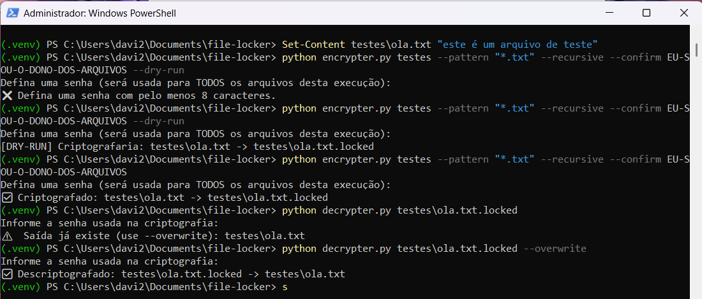

# 🛡️ File Locker – Criptografia de Arquivos em Python

📸 Execução de Teste:

Veja abaixo a imagem de execução do encriptador:

🔐 Uso básico:

Criptografar:

python encrypter.py testes --pattern "*.txt" --recursive --confirm "EU-SOU-O-DONO-DOS-ARQUIVOS"

Descriptografar:

python decrypter.py testes\ola.txt.locked --overwrite



## 📖 Descrição
Projeto educacional que demonstra **criptografia simétrica segura** e **organização de projeto**, **sem comportamento malicioso**.  
✅ Não se propaga  
✅ Não deleta arquivos  
✅ Não exige resgate  
👉 Serve apenas para proteger arquivos **do próprio usuário**.

---

## ⚙️ Tecnologias
- Python 3.10+
- Biblioteca [`cryptography`](https://pypi.org/project/cryptography/)
- Fernet (AES-256)
- PBKDF2-HMAC-SHA256 com sal por arquivo

---

## 📦 Instalação
```bash
# 1. Criar ambiente virtual
python -m venv .venv

# 2. Ativar
# Windows:
.venv\Scripts\activate
# Linux/macOS:
source .venv/bin/activate

# 3. Instalar dependências
pip install -r requirements.txt

🧠 Recursos

Criptografia simétrica segura com senha

Suporte a múltiplos arquivos e diretórios

Modo --dry-run para testar antes de alterar

Senhas derivadas com PBKDF2 e sal único por arquivo

⚠️ Aviso Ético

Este projeto é apenas para fins educacionais e laboratoriais.
Não utilize em sistemas ou arquivos de terceiros sem autorização.

👨‍💻 Autor

Davi Menezes Vasques
📧 blackwatch.phishingedu@gmail.com
🕶️ Hacker Ético | Pentest | Engenharia

📜 Licença

Este projeto é livre para uso educacional


